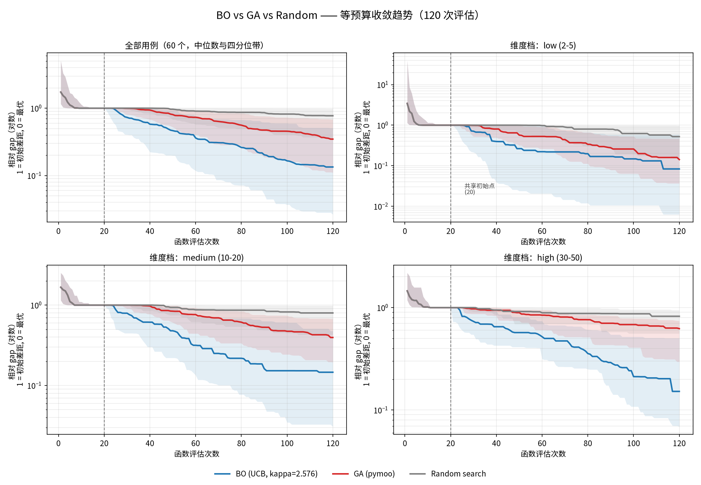
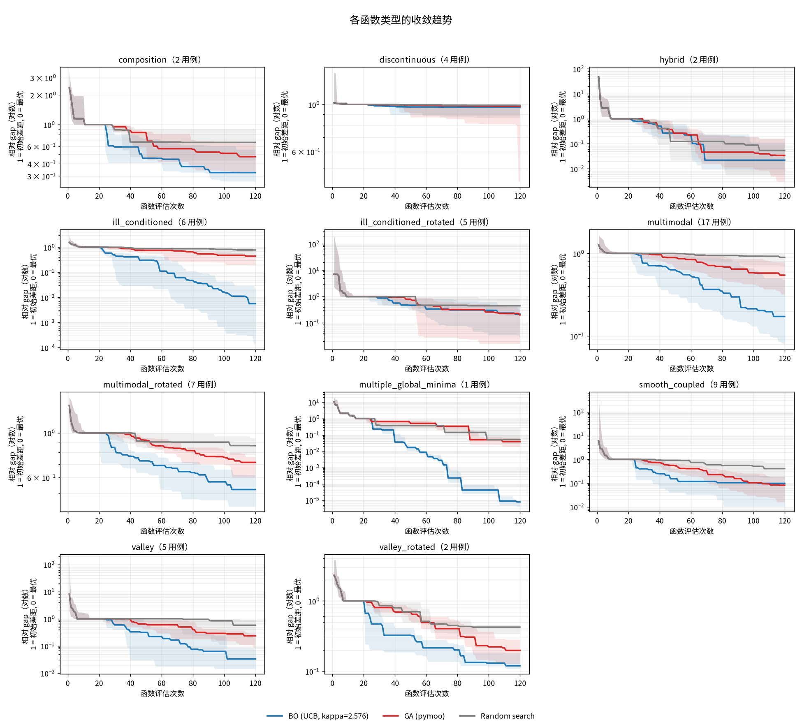
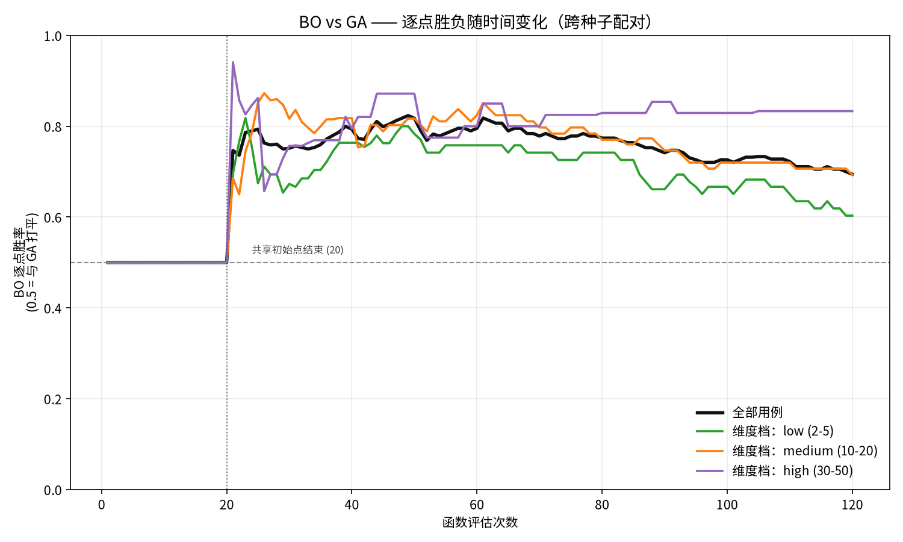

# BO vs GA vs Random —— 等预算对比汇总

有效用例 60 个（21 个函数族，种子 0/1/42）；每个用例共 120 次函数评估，前 20 点为三方共享初始点，取三次种子中位数。已排除 CEC_F10/F17（opfunu 1.0.1 的 modified Schwefel 实现缺陷）。

## 1. 总体结论

- 按种子中位数判定：**BO 胜 44 / GA 胜 16 / 平 0**（BO 占 73%）
- 逐种子配对（共 180 对）：BO 更优 125 次，GA 更优 55 次
- 相对 gap 中位数（越小越好）：BO 0.129，GA 0.347，Random 0.745
- 单用例耗时中位数：BO 30.16s，GA 0.0054s，Random 0.0004s

## 2. 收敛趋势

纵轴为相对 gap（对数）：1 = 初始差距，0 = 已知最优；曲线为跨种子/用例的中位数，阴影为四分位带。

## 3. 逐点胜负（BO vs GA）

在每一次评估处，按三次种子配对比较 BO 与 GA 的 best-so-far，胜率 0.5 表示打平。

| 评估次数 | BO胜点 | GA胜点 | 平 | BO胜率 |
|---|---|---|---|---|
| 20 | 0 | 0 | 180 | 0.50 |
| 40 | 127 | 33 | 20 | 0.79 |
| 60 | 140 | 36 | 4 | 0.80 |
| 80 | 137 | 40 | 3 | 0.77 |
| 100 | 130 | 49 | 1 | 0.73 |
| 120 | 125 | 55 | 0 | 0.69 |

到 120 次评估时，BO 在 125 / 180 个已分出的配对上领先（胜率 0.69）；20 次评估（共享初始点结束）时两者完全相同。

## 4. 按维度档

| 维度档 | 用例 | BO胜 | GA胜 | BO相对gap | GA相对gap | 随机相对gap |
|---|---|---|---|---|---|---|
| low (2-5) | 21 | 13 | 8 | 0.083 | 0.111 | 0.571 |
| medium (10-20) | 25 | 19 | 6 | 0.136 | 0.361 | 0.798 |
| high (30-50) | 14 | 12 | 2 | 0.128 | 0.584 | 0.797 |

## 5. 按函数类型

| 分组 | 用例 | BO胜 | GA胜 | BO相对gap | GA相对gap | 随机相对gap |
|---|---|---|---|---|---|---|
| composition | 2 | 2 | 0 | 0.441 | 0.507 | 0.659 |
| discontinuous | 4 | 3 | 1 | 0.969 | 0.981 | 0.992 |
| hybrid | 2 | 1 | 1 | 0.069 | 0.096 | 0.096 |
| ill_conditioned | 6 | 6 | 0 | 0.006 | 0.426 | 0.771 |
| ill_conditioned_rotated | 5 | 1 | 4 | 0.231 | 0.131 | 0.396 |
| multimodal | 17 | 13 | 4 | 0.146 | 0.594 | 0.815 |
| multimodal_rotated | 7 | 5 | 2 | 0.544 | 0.713 | 0.864 |
| multiple_global_minima | 1 | 1 | 0 | 0.000 | 0.038 | 0.050 |
| smooth_coupled | 9 | 5 | 4 | 0.085 | 0.048 | 0.409 |
| valley | 5 | 5 | 0 | 0.033 | 0.150 | 0.459 |
| valley_rotated | 2 | 2 | 0 | 0.120 | 0.185 | 0.388 |

## 6. 按函数族

| 分组 | 用例 | BO胜 | GA胜 | BO相对gap | GA相对gap | 随机相对gap |
|---|---|---|---|---|---|---|
| Ackley01 | 7 | 6 | 1 | 0.488 | 0.918 | 0.988 |
| Beale | 1 | 1 | 0 | 0.837 | 0.495 | 0.299 |
| Branin01 | 1 | 1 | 0 | 0.000 | 0.038 | 0.050 |
| Brown | 3 | 0 | 3 | 0.470 | 0.048 | 0.340 |
| CEC_F1 | 2 | 0 | 2 | 0.369 | 0.201 | 0.487 |
| CEC_F19 | 2 | 1 | 1 | 0.069 | 0.096 | 0.096 |
| CEC_F2 | 1 | 1 | 0 | 0.007 | 0.368 | 1.000 |
| CEC_F23 | 2 | 2 | 0 | 0.441 | 0.507 | 0.659 |
| CEC_F3 | 2 | 0 | 2 | 0.519 | 0.014 | 0.216 |
| CEC_F4 | 2 | 2 | 0 | 0.120 | 0.185 | 0.388 |
| CEC_F5 | 1 | 0 | 1 | 0.991 | 0.976 | 0.987 |
| CEC_F6 | 1 | 1 | 0 | 0.552 | 0.751 | 0.865 |
| CEC_F7 | 1 | 1 | 0 | 0.004 | 0.360 | 0.446 |
| CEC_F9 | 4 | 3 | 1 | 0.534 | 0.702 | 0.850 |
| ChungReynolds | 6 | 5 | 1 | 0.022 | 0.050 | 0.529 |
| Cigar | 6 | 6 | 0 | 0.006 | 0.426 | 0.771 |
| Corana | 1 | 0 | 1 | 0.083 | 0.140 | 0.246 |
| DixonPrice | 4 | 4 | 0 | 0.024 | 0.106 | 0.608 |
| Griewank | 6 | 5 | 1 | 0.119 | 0.520 | 0.834 |
| Levy03 | 4 | 2 | 2 | 0.101 | 0.150 | 0.622 |
| NeedleEye | 3 | 3 | 0 | 0.973 | 0.981 | 0.993 |

## 7. 逐用例明细

| 用例 | 维 | 类型 | 已知最优 | 初始gap | BO最优 | GA最优 | 随机最优 | BO相对gap | GA相对gap | 随机相对gap | 胜方 |
|---|---|---|---|---|---|---|---|---|---|---|---|
| Ackley01_2D | 2 | multimodal | 0 | 13.73 | 2.553 | 4.965 | 9.792 | 0.142 | 0.276 | 0.713 | BO |
| Ackley01_3D | 3 | multimodal | 0 | 16.79 | 0.8012 | 11.25 | 13.55 | 0.048 | 0.594 | 0.807 | BO |
| Ackley01_5D | 5 | multimodal | 0 | 20.05 | 16.89 | 14.87 | 17.97 | 0.842 | 0.758 | 0.988 | GA |
| Ackley01_10D | 10 | multimodal | 0 | 20.58 | 5.028 | 19.23 | 20.09 | 0.257 | 0.918 | 0.980 | BO |
| Ackley01_20D | 20 | multimodal | 0 | 20.73 | 10.04 | 20.01 | 20.57 | 0.488 | 0.972 | 0.999 | BO |
| Ackley01_30D | 30 | multimodal | 0 | 20.91 | 19.25 | 20.5 | 20.75 | 0.921 | 0.978 | 0.994 | BO |
| Ackley01_50D | 50 | multimodal | 0 | 20.98 | 19.87 | 20.69 | 20.95 | 0.940 | 0.990 | 0.999 | BO |
| Beale_2D | 2 | valley | 0 | 1.945 | 0.2373 | 0.5484 | 0.2373 | 0.837 | 0.495 | 0.299 | BO |
| Branin01_2D | 2 | multiple_global_minima | 0.3979 | 7.091 | 0.3979 | 0.6681 | 0.8193 | 0.000 | 0.038 | 0.050 | BO |
| Brown_2D | 2 | smooth_coupled | 0 | 0.08886 | 0.0251 | 0.001066 | 0.08144 | 1.000 | 0.048 | 0.917 | GA |
| Brown_5D | 5 | smooth_coupled | 0 | 8.478 | 3.348 | 0.7906 | 1.478 | 0.470 | 0.120 | 0.340 | GA |
| Brown_10D | 10 | smooth_coupled | 0 | 127 | 16.52 | 4.46 | 22.94 | 0.127 | 0.032 | 0.184 | GA |
| CEC_F1_10D | 10 | ill_conditioned_rotated | 100 | 8.64e+08 | 1.99e+08 | 1.13e+08 | 1.73e+08 | 0.231 | 0.131 | 0.240 | GA |
| CEC_F1_30D | 30 | ill_conditioned_rotated | 100 | 4.39e+09 | 1.50e+09 | 1.44e+09 | 2.82e+09 | 0.507 | 0.271 | 0.733 | GA |
| CEC_F19_10D | 10 | hybrid | 1.9e+03 | 1.52e+08 | 1.14e+06 | 3.95e+05 | 5.97e+05 | 0.007 | 0.003 | 0.004 | GA |
| CEC_F19_30D | 30 | hybrid | 1.9e+03 | 1.43e+10 | 1.05e+09 | 1.32e+09 | 2.70e+09 | 0.131 | 0.190 | 0.189 | BO |
| CEC_F2_10D | 10 | ill_conditioned_rotated | 200 | 1.60e+10 | 1.37e+08 | 5.39e+09 | 1.07e+10 | 0.007 | 0.368 | 1.000 | BO |
| CEC_F23_10D | 10 | composition | 2.3e+03 | 576 | 2.67e+03 | 2.67e+03 | 2.77e+03 | 0.634 | 0.662 | 0.816 | BO |
| CEC_F23_30D | 30 | composition | 2.3e+03 | 3.1e+03 | 3.02e+03 | 3.41e+03 | 3.89e+03 | 0.248 | 0.351 | 0.501 | BO |
| CEC_F3_10D | 10 | ill_conditioned_rotated | 300 | 2.97e+06 | 2.44e+06 | 8.06e+04 | 3.44e+05 | 1.000 | 0.014 | 0.396 | GA |
| CEC_F3_30D | 30 | ill_conditioned_rotated | 300 | 1.58e+07 | 6.00e+05 | 1.96e+05 | 5.69e+05 | 0.037 | 0.013 | 0.036 | GA |
| CEC_F4_10D | 10 | valley_rotated | 400 | 5.09e+03 | 1.24e+03 | 1.38e+03 | 1.8e+03 | 0.116 | 0.120 | 0.317 | BO |
| CEC_F4_30D | 30 | valley_rotated | 400 | 8.21e+04 | 1.09e+04 | 1.49e+04 | 3.36e+04 | 0.124 | 0.249 | 0.458 | BO |
| CEC_F5_10D | 10 | multimodal_rotated | 500 | 21.26 | 521 | 521 | 521 | 0.991 | 0.976 | 0.987 | GA |
| CEC_F6_10D | 10 | multimodal_rotated | 600 | 15.59 | 609 | 612 | 613 | 0.552 | 0.751 | 0.865 | BO |
| CEC_F7_10D | 10 | multimodal_rotated | 700 | 275 | 701 | 832 | 834 | 0.004 | 0.360 | 0.446 | BO |
| CEC_F9_10D | 10 | multimodal_rotated | 900 | 158 | 982 | 978 | 1.02e+03 | 0.588 | 0.460 | 0.864 | GA |
| CEC_F9_20D | 20 | multimodal_rotated | 900 | 373 | 1.1e+03 | 1.15e+03 | 1.21e+03 | 0.523 | 0.690 | 0.835 | BO |
| CEC_F9_30D | 30 | multimodal_rotated | 900 | 741 | 1.24e+03 | 1.43e+03 | 1.51e+03 | 0.490 | 0.722 | 0.829 | BO |
| CEC_F9_50D | 50 | multimodal_rotated | 900 | 1.35e+03 | 1.62e+03 | 1.87e+03 | 2.11e+03 | 0.544 | 0.713 | 0.910 | BO |
| ChungReynolds_2D | 2 | smooth_coupled | 0 | 1.69e+05 | 1.412 | 7.665 | 1.04e+04 | 0.000 | 0.000 | 0.062 | BO |
| ChungReynolds_3D | 3 | smooth_coupled | 0 | 2.48e+06 | 6.28e+03 | 3.64e+04 | 3.02e+05 | 0.004 | 0.015 | 0.159 | BO |
| ChungReynolds_5D | 5 | smooth_coupled | 0 | 4.29e+07 | 8.46e+05 | 7.25e+05 | 8.65e+06 | 0.010 | 0.017 | 0.767 | GA |
| ChungReynolds_10D | 10 | smooth_coupled | 0 | 5.60e+08 | 1.54e+07 | 3.71e+07 | 1.55e+08 | 0.034 | 0.083 | 0.409 | BO |
| ChungReynolds_20D | 20 | smooth_coupled | 0 | 1.73e+09 | 2.61e+08 | 5.40e+08 | 1.29e+09 | 0.136 | 0.355 | 0.709 | BO |
| ChungReynolds_30D | 30 | smooth_coupled | 0 | 5.90e+09 | 5.02e+08 | 2.02e+09 | 3.60e+09 | 0.085 | 0.343 | 0.649 | BO |
| Cigar_2D | 2 | ill_conditioned | 0 | 3.34e+07 | 907 | 1.87e+05 | 8.53e+05 | 0.000 | 0.006 | 0.019 | BO |
| Cigar_5D | 5 | ill_conditioned | 0 | 3.49e+09 | 4.87e+05 | 4.92e+08 | 1.97e+09 | 0.000 | 0.111 | 0.762 | BO |
| Cigar_10D | 10 | ill_conditioned | 0 | 1.95e+10 | 7.51e+07 | 4.76e+09 | 1.00e+10 | 0.004 | 0.336 | 0.640 | BO |
| Cigar_20D | 20 | ill_conditioned | 0 | 3.91e+10 | 3.13e+08 | 2.18e+10 | 3.22e+10 | 0.008 | 0.516 | 0.822 | BO |
| Cigar_30D | 30 | ill_conditioned | 0 | 7.29e+10 | 1.79e+09 | 4.02e+10 | 5.75e+10 | 0.024 | 0.563 | 0.779 | BO |
| Cigar_50D | 50 | ill_conditioned | 0 | 1.30e+11 | 8.07e+09 | 9.05e+10 | 1.23e+11 | 0.057 | 0.695 | 0.895 | BO |
| Corana_4D | 4 | discontinuous | 0 | 169 | 22.78 | 10.62 | 32 | 0.083 | 0.140 | 0.246 | GA |
| DixonPrice_2D | 2 | valley | 0 | 8.55 | 0.4198 | 0.4354 | 1.507 | 0.033 | 0.024 | 0.061 | BO |
| DixonPrice_5D | 5 | valley | 0 | 9.45e+03 | 105 | 712 | 2.73e+03 | 0.015 | 0.063 | 0.756 | BO |
| DixonPrice_10D | 10 | valley | 0 | 2.08e+05 | 2.39e+03 | 2.27e+04 | 4.62e+04 | 0.009 | 0.150 | 0.459 | BO |
| DixonPrice_20D | 20 | valley | 0 | 8.00e+05 | 3.35e+04 | 2.30e+05 | 5.16e+05 | 0.042 | 0.288 | 0.814 | BO |
| Griewank_2D | 2 | multimodal | 0 | 0.812 | 0.1668 | 0.1353 | 0.2982 | 0.197 | 0.290 | 0.571 | GA |
| Griewank_5D | 5 | multimodal | 0 | 2.272 | 0.7982 | 1.04 | 1.72 | 0.351 | 0.434 | 0.980 | BO |
| Griewank_10D | 10 | multimodal | 0 | 6.929 | 1.012 | 2.524 | 4.109 | 0.146 | 0.427 | 0.691 | BO |
| Griewank_20D | 20 | multimodal | 0 | 11.41 | 1.052 | 6.811 | 9.994 | 0.092 | 0.631 | 0.854 | BO |
| Griewank_30D | 30 | multimodal | 0 | 20.2 | 1.519 | 12.24 | 15.99 | 0.075 | 0.606 | 0.815 | BO |
| Griewank_50D | 50 | multimodal | 0 | 34.63 | 2.859 | 25.19 | 32.02 | 0.083 | 0.708 | 0.895 | BO |
| Levy03_2D | 2 | multimodal | 0 | 1.219 | 0.03317 | 0.02832 | 0.09121 | 0.027 | 0.046 | 0.148 | GA |
| Levy03_5D | 5 | multimodal | 0 | 9.982 | 2.1 | 1.225 | 5.212 | 0.142 | 0.077 | 0.522 | GA |
| Levy03_10D | 10 | multimodal | 0 | 42.42 | 3.603 | 14.85 | 32.03 | 0.061 | 0.223 | 0.798 | BO |
| Levy03_20D | 20 | multimodal | 0 | 146 | 52.23 | 57.37 | 106 | 0.358 | 0.361 | 0.723 | BO |
| NeedleEye_2D | 2 | discontinuous | 1 | 202 | 200 | 200 | 201 | 0.986 | 0.980 | 0.993 | BO |
| NeedleEye_5D | 5 | discontinuous | 1 | 514 | 501 | 504 | 511 | 0.973 | 0.981 | 0.999 | BO |
| NeedleEye_10D | 10 | discontinuous | 1 | 1.04e+03 | 1e+03 | 1.02e+03 | 1.03e+03 | 0.966 | 0.984 | 0.991 | BO |

## 附：文件

- `optimization_suite_report.csv`：逐用例明细（本文件第 7 节的机器可读版本）
- `optimization_suite_convergence.csv`：各分组、各方法的 best-so-far 曲线（median/mean/p25/p75）
- `optimization_suite_convergence_sampled.csv`：同上，仅保留第 10/20/…/120 次评估的采样点
- `optimization_suite_winrate.csv`：各分组的逐点 BO-vs-GA 胜负计数与胜率
- `optimization_suite_convergence.png`：整体 + 维度档收敛图
- `optimization_suite_convergence_categories.png`：各函数类型收敛图
- `optimization_suite_winrate.png`：BO 逐点胜率曲线

